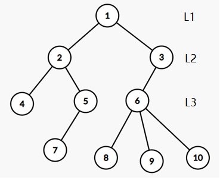

# C. yanje en yanje

### 思路和解法：

纯粹模拟染色呗，各个点之间的方案数目用乘法原理总和起来。emmm，当然还有一些细节。

1.模拟的过程的序怎么定呢？根据题意，1号节点总是存在的，那么可以把一号节点当作树根，让无根树变成有根树深搜，这是一个可行方案。

2.每个点的方案数目怎么确定呢？这里偷图了。

一般来说，对于一个点的颜色限制，由题意，来自于其父亲，其祖父，其兄弟。（*注意，此时按照深搜的原则，儿子节点一定没有被染色，对该点无影响，同理，其未被染色的兄弟节点对该点也无影响*）并且，上述三类节点的距离都不超过2，所以必定两两异色，所以当前点的染色种类数目为k-b-2（b为已经被染了色的兄弟数目）。但同样需要注意的是，对于根节点，无父亲，祖父，兄弟，显然为k，对于根节点的儿子节点，无祖父，应该为k-1-b。

3.那么如何统计方案数目呢？让dfs函数返回当前节点的子树对答案的贡献即可。

具体请看代码，有注释

### 时间复杂度：

$O(N)$遍历树

### 空间复杂度：

$O(N)$